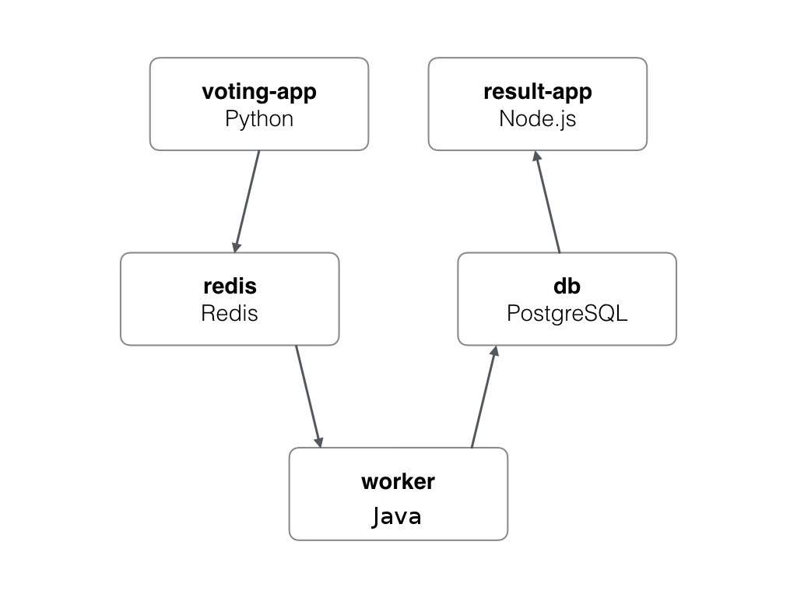

Example Voting App On Openshift
=========

Getting started
---------------

Access your environment with Openshift CLI (OC):
```
oc login https://api.getupcloud.com:443 
```

And access your project 
```
oc project <Name>
```

Run in this directory:
```
./deploy.sh
```

This will create all apps, redis and postgresql.


Architecture
-----



* A Python webapp which lets you vote between two options
* A Redis queue which collects new votes
* A Java worker which consumes votes and stores them in…
* A Postgres database backed by a Docker volume
* A Node.js webapp which shows the results of the voting in real time


Note
----

The voting application only accepts one vote per client. It does not register votes if a vote has already been submitted from a client, but you can always change your vote. (or open a Incognito Tab :)


And that's it, like magic !!